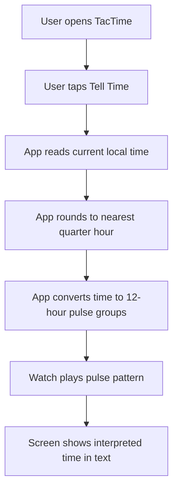

# TacTime MVP

## Problem Frame
TacTime is a Wear OS app for telling the current time through vibrations so a user can check the time without needing to read the watch face closely. The MVP should prove that a simple, learnable haptic language can communicate the current time quickly and reliably on demand.

## Requirements

**Core Interaction**
- R1. The app must present a primary `Tell Time` action on the main screen.
- R2. When the user triggers `Tell Time`, the app must read the current local time on the watch and interpret it immediately.
- R3. After playback, the app must show the interpreted time in plain text on screen, using wording such as `About 3:15 PM`.

**Time Interpretation**
- R4. The MVP must interpret time using a 12-hour clock, not a 24-hour pulse count.
- R5. The MVP must round the current time to the nearest quarter-hour before encoding it.
- R5a. When the current time falls exactly halfway between two quarter-hour values, the MVP must round up to the later quarter-hour.
- R6. The supported interpreted outcomes for the MVP are `:00`, `:15`, `:30`, and `:45`.

**Haptic Language**
- R7. The haptic pattern must encode the hour as a first group of short pulses.
- R8. For quarter-hours other than `:00`, the haptic pattern must include a pause followed by a second group of short pulses representing the quarter count.
- R9. For `:00`, the app must play only the hour pulse group and omit the second group entirely.
- R10. Example mappings for the MVP must follow this pattern:
  - `3:00` -> `3 pulses`
  - `3:15` -> `3 pulses`, pause, `1 pulse`
  - `3:30` -> `3 pulses`, pause, `2 pulses`
  - `3:45` -> `3 pulses`, pause, `3 pulses`

## Success Criteria
- A user can trigger the time-telling action with one obvious tap from the main screen.
- The app consistently rounds and displays the interpreted time as one of the four quarter-hour values.
- The pulse pattern and the on-screen interpreted time match for each supported case.
- The MVP is simple enough to test quickly on a real Wear OS watch.

## Scope Boundaries
- No background or scheduled time announcements.
- No tile, complication, watch face, or phone companion app in the MVP.
- No settings or customization for 24-hour time, alternate vibration languages, or different rounding rules in the MVP.
- No attempt to support watchOS in the MVP.

## Key Decisions
- On-demand interaction first: the MVP centers on a single `Tell Time` button to keep learning and testing simple.
- Quarter-hour precision: this is more useful than hour-only output while staying easier to learn than full-minute encoding.
- Two short-pulse groups: hour and quarter are both represented with short pulses, separated by a pause, to keep the language consistent and quick.
- Plain-text confirmation after playback: the app should show the interpreted time after vibration so the user can learn and verify the haptic language.

## Dependencies / Assumptions
- The watch can reliably play a short sequence of custom vibration pulses from the app.
- Local watch time is the source of truth for the interpreted time.

## Outstanding Questions

### Deferred to Planning
- [Affects R7-R9][Technical] What pulse duration, gap duration, and group-separation pause produce the clearest feel on the Galaxy Watch 6 Classic?
- [Affects R3][Technical] What exact confirmation copy reads best on a small round screen while still helping the user learn the pattern?

## Next Steps
-> /prompts:ce-plan for structured implementation planning
