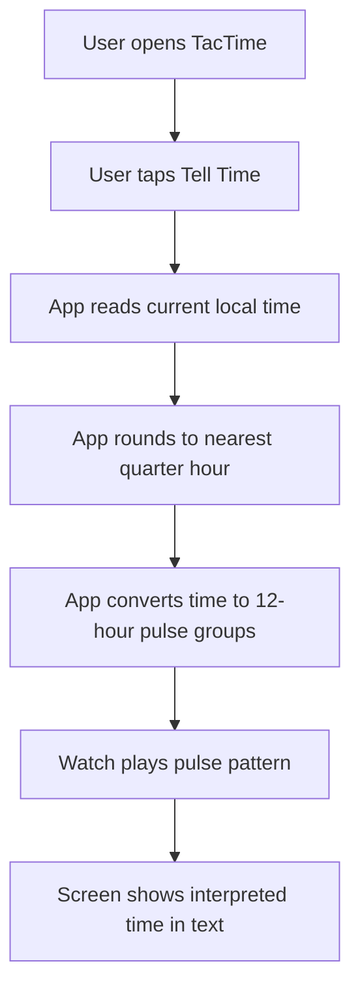

# TacTime MVP

## Problem Frame
TacTime is a Wear OS app for telling the current time through vibrations so a user can check the time without needing to read the watch face closely. The MVP should prove that a simple, learnable haptic language can communicate the current time quickly and reliably on demand.

## Requirements

**Core Interaction**
- R1. The app must present a primary `Tell Time` action on the main screen.
- R2. When the user triggers `Tell Time`, the app must read the current local time on the watch and interpret it immediately.
- R3. After playback, the app must show the interpreted time in plain text on screen, using wording such as `About 3:15 PM`.
- R3a. The app must rely on manual re-triggering through the existing `Tell Time` action rather than automatically replaying the pattern after it finishes.

**Time Interpretation**
- R4. The MVP must interpret time using a 12-hour clock, not a 24-hour pulse count.
- R5. The MVP must round the current time to the nearest quarter-hour before encoding it.
- R5a. When the current time falls exactly halfway between two quarter-hour values, the MVP must round up to the later quarter-hour.
- R6. The supported interpreted outcomes for the MVP are `:00`, `:15`, `:30`, and `:45`.

**Haptic Language**
- R7. The haptic pattern may begin with a distinct lead-in pulse and short settling pause to help the user notice the playback before the countable pulses begin.
- R8. The haptic pattern must encode the hour as the first countable group of short pulses.
- R9. For quarter-hours other than `:00`, the haptic pattern must include a pause followed by a second countable group of short pulses representing the quarter count.
- R10. For `:00`, the app must play only the hour pulse group and omit the second group entirely.
- R11. Example mappings for the MVP must follow this pattern after any lead-in cue:
  - `3:00` -> lead-in cue, `3 pulses`
  - `3:15` -> lead-in cue, `3 pulses`, pause, `1 pulse`
  - `3:30` -> lead-in cue, `3 pulses`, pause, `2 pulses`
  - `3:45` -> lead-in cue, `3 pulses`, pause, `3 pulses`
- R12. The default haptic timing must be tuned for a balanced feel, prioritizing both readability and reasonably quick playback on the watch.
- R13. The MVP must keep the literal hour-count encoding for larger hour values such as `11` and `12`, rather than introducing special-case shortcuts in this tuning pass.
- R14. The MVP must ship with one tuned default haptic pattern in code and must not add user-facing tuning settings in this pass.

## Success Criteria
- A user can trigger the time-telling action with one obvious tap from the main screen.
- The app consistently rounds and displays the interpreted time as one of the four quarter-hour values.
- The pulse pattern and the on-screen interpreted time match for each supported case.
- The MVP is simple enough to test quickly on a real Wear OS watch.
- The default pulse timing feels balanced enough on the Galaxy Watch 6 Classic that the user can usually count the pattern without it feeling unnecessarily slow.

## Scope Boundaries
- No background or scheduled time announcements.
- No tile, complication, watch face, or phone companion app in the MVP.
- No settings or customization for 24-hour time, alternate vibration languages, or different rounding rules in the MVP.
- No user-facing vibration speed or tuning controls in this pass.
- No attempt to support watchOS in the MVP.

## Key Decisions
- On-demand interaction first: the MVP centers on a single `Tell Time` button to keep learning and testing simple.
- Quarter-hour precision: this is more useful than hour-only output while staying easier to learn than full-minute encoding.
- A short lead-in cue is acceptable: the app may start with one longer attention pulse before the countable hour and quarter groups begin.
- Two short-pulse groups: hour and quarter are both represented with short pulses, separated by a pause, to keep the language consistent and quick once counting starts.
- Plain-text confirmation after playback: the app should show the interpreted time after vibration so the user can learn and verify the haptic language.
- Balanced tuning over extreme speed or maximum separation: this pass should make the default pattern feel both countable and reasonably fast.
- Keep literal hour counts for now: even large hour values such as `11` and `12` should continue using the same pulse language so the system stays internally consistent.
- Manual retry only: users can tap again if they miss a pattern, but the app should not automatically replay it.

## Dependencies / Assumptions
- The watch can reliably play a short sequence of custom vibration pulses from the app.
- Local watch time is the source of truth for the interpreted time.

## Outstanding Questions

### Deferred to Planning
- [Affects R12-R14][Technical] What exact lead-in duration, lead-in pause, pulse duration, inter-pulse gap, and group-separation pause best achieve the chosen balanced feel on the Galaxy Watch 6 Classic?
- [Affects R3][Technical] What exact confirmation copy reads best on a small round screen while still helping the user learn the pattern?

## Next Steps
-> /prompts:ce-plan for structured implementation planning
