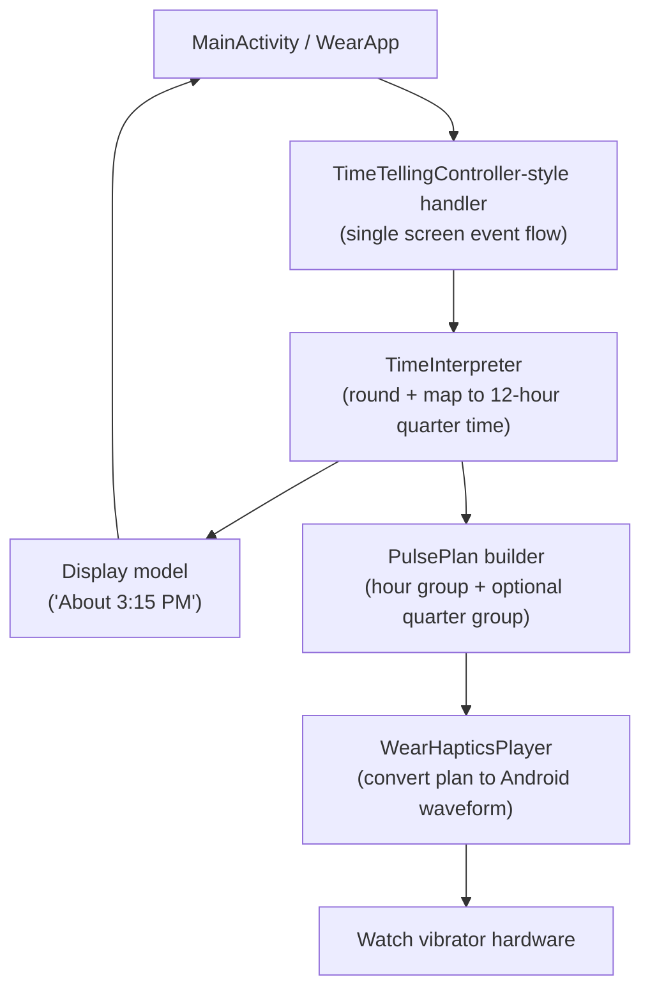
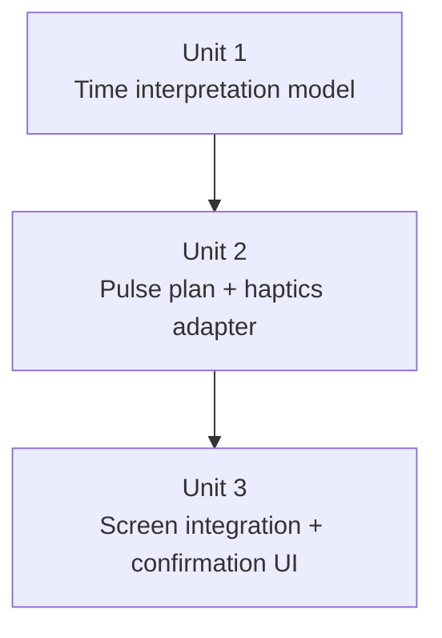

# feat: Build TacTime Wear OS MVP

## Overview

Build the first usable version of TacTime as a standalone Wear OS app that tells time on demand through a simple pulse language. The implementation should keep the logic for time interpretation and pulse-shape generation separate from the Android platform vibration layer so the core behavior is easy to test and the watch-specific code stays small.

## Problem Frame

TacTime needs to let a user check the time through haptics without reading the watch face closely. The source requirements already define the product behavior: one obvious `Tell Time` action, 12-hour interpretation, nearest-quarter rounding with midpoint ties rounding up, and plain-text confirmation after playback (see origin: `docs/brainstorms/2026-04-10-tactime-mvp-requirements.md`).

## Requirements Trace

- R1. Present a primary `Tell Time` action on the main screen.
- R2. Read the current local watch time when the user triggers the action.
- R3. Show the interpreted time in plain text after playback.
- R4. Encode time in 12-hour form.
- R5. Round to the nearest quarter-hour.
- R5a. Round exact midpoints up.
- R6. Support `:00`, `:15`, `:30`, and `:45`.
- R7. Encode the hour as the first pulse group.
- R8. Encode quarter count as a second pulse group after a pause when quarter is non-zero.
- R9. Omit the second pulse group for `:00`.
- R10. Preserve the agreed example mappings.

## Scope Boundaries

- No background playback, tile, complication, watch face, or phone companion.
- No settings for alternate haptic languages, 24-hour mode, or different rounding behavior.
- No watchOS implementation in this plan.

## Context & Research

### Relevant Code and Patterns

- The project is a new single-module Wear OS app rooted at [app/build.gradle.kts](/Users/colin.finger/tactime/app/build.gradle.kts) using Kotlin, Compose for Wear OS Material 3, and a standalone watch manifest in [AndroidManifest.xml](/Users/colin.finger/tactime/app/src/main/AndroidManifest.xml).
- The current UI shell lives in [MainActivity.kt](/Users/colin.finger/tactime/app/src/main/java/com/colfinstudio/tactime/presentation/MainActivity.kt) and already proves the basic button-driven interaction model.
- The theme wrapper in [Theme.kt](/Users/colin.finger/tactime/app/src/main/java/com/colfinstudio/tactime/presentation/theme/Theme.kt) is intentionally empty, so visual polish should stay light in MVP and not drive architecture.

### Institutional Learnings

- No existing `docs/solutions/` or local feature patterns were found, so the plan should favor simple, testable structure over speculative abstraction.

### External References

- Android Developers recommends Compose for Wear OS for modern watch UI work: [Compose for Wear OS](https://developer.android.com/training/wearables/compose-setup).
- Wear OS app creation guidance aligns with the generated standalone app structure already in the repo: [Create and run your first Wear OS app](https://developer.android.com/training/wearables/get-started/creating).
- Android vibration APIs support waveform playback and capability checks through `Vibrator`/`VibrationEffect`: [Vibrator API reference](https://developer.android.com/reference/android/os/Vibrator), [VibrationEffect API reference](https://developer.android.com/reference/android/os/VibrationEffect).
- `java.time.LocalTime` is available on the app’s min SDK and supports clock-based and injectable time access patterns: [LocalTime API reference](https://developer.android.com/reference/java/time/LocalTime).

## Key Technical Decisions

- **Keep interpretation logic pure Kotlin**: Rounding, 12-hour conversion, quarter extraction, and human-readable formatting should live outside the Compose screen and outside the Android vibrator wrapper. This gives us fast local tests for the logic that actually defines the product behavior.
- **Model haptics in two layers**: a pure “pulse plan” layer should describe pulses, gaps, and group separation, and a thin Android layer should translate that plan into a waveform vibration. This keeps the difficult-to-tune pulse timing isolated from the UI and preserves room for future platform ports without committing to them now.
- **Use the watch’s local time as the default source, but inject a clock-shaped dependency**: the requirements explicitly rely on local watch time, while injected time access keeps rounding and formatting deterministic in tests.
- **Favor a single-screen state model over app architecture ceremony**: for an MVP with one action and one result state, adding navigation, DI frameworks, or a ViewModel layer would create more carrying cost than value.

## Open Questions

### Resolved During Planning

- What architectural shape best fits this MVP? A single screen plus small domain and platform helper classes is the right fit because the app has one action, one output, and no persistence.
- How should midpoint ties be implemented? They should be encoded in a pure rounding function so cases like `3:08` and `3:53` are testable without device execution.
- Where should confirmation copy come from? Use app string resources for the user-facing text while keeping the actual formatted time string generated by the domain formatter.

### Deferred to Implementation

- What exact pulse duration, inter-pulse gap, and group-separation pause feel clearest on the Galaxy Watch 6 Classic? This depends on hands-on tuning against real hardware and should be finalized while implementing the haptics adapter.
- Should the device haptics wrapper branch on capability checks or rely on waveform playback directly? The implementation should choose the smallest reliable approach once the exact API behavior is confirmed in code.

## High-Level Technical Design

> *This illustrates the intended approach and is directional guidance for review, not implementation specification. The implementing agent should treat it as context, not code to reproduce.*

## Implementation Units

- [x] **Unit 1: Build the time interpretation model**

**Goal:** Create the pure logic that reads a time value, rounds it to the nearest quarter-hour with ties rounding up, converts it to the 12-hour format, and produces a display-ready interpreted result.

**Requirements:** R2, R3, R4, R5, R5a, R6, R10

**Dependencies:** None

**Files:**
- Create: `/Users/colin.finger/tactime/app/src/main/java/com/colfinstudio/tactime/time/InterpretedTime.kt`
- Create: `/Users/colin.finger/tactime/app/src/main/java/com/colfinstudio/tactime/time/TimeInterpreter.kt`
- Create: `/Users/colin.finger/tactime/app/src/test/java/com/colfinstudio/tactime/time/TimeInterpreterTest.kt`
- Modify: `/Users/colin.finger/tactime/app/build.gradle.kts`

**Approach:**
- Introduce a small immutable model that represents the interpreted hour, quarter count, and display text instead of passing raw integers through the UI.
- Keep the rounding algorithm independent from Android APIs by accepting a `LocalTime` input and returning an interpreted model.
- Centralize tie-breaking in one function so all midpoint behavior is consistent and testable.
- Add only the minimal local test dependency needed for JVM tests if the generated template does not already include one.

**Patterns to follow:**
- Keep the logic decoupled from [MainActivity.kt](/Users/colin.finger/tactime/app/src/main/java/com/colfinstudio/tactime/presentation/MainActivity.kt) the way the theme wrapper is already separated from the screen.
- Follow Kotlin-first, small-file organization under the app package rather than introducing feature modules.

**Test scenarios:**
- Happy path: `03:00` interprets to hour `3`, quarter `0`, and display text equivalent to `About 3:00 AM`.
- Happy path: `15:30` interprets to hour `3`, quarter `2`, and display text equivalent to `About 3:30 PM`.
- Edge case: `00:00` interprets to `12:00 AM` rather than `0:00 AM`.
- Edge case: `12:00` interprets to `12:00 PM` rather than `0:00 PM`.
- Edge case: `03:07` rounds to `3:00`, while `03:08` rounds to `3:15`.
- Edge case: `03:22` rounds to `3:15`, while `03:23` rounds to `3:30`.
- Edge case: `03:37` rounds to `3:30`, while `03:38` rounds to `3:45`.
- Edge case: `03:52` rounds to `3:45`, while `03:53` rounds to `4:00`.
- Edge case: `11:53 PM` rolls across the day boundary to `12:00 AM` display output.

**Verification:**
- Given a fixed `LocalTime`, the interpreter always returns one of the four allowed quarter values and the expected 12-hour display output.

- [x] **Unit 2: Build the pulse plan and watch haptics adapter**

**Goal:** Represent the agreed haptic language as a pulse plan and translate that plan into a watch vibration waveform that can be played on demand.

**Requirements:** R7, R8, R9, R10

**Dependencies:** Unit 1

**Files:**
- Create: `/Users/colin.finger/tactime/app/src/main/java/com/colfinstudio/tactime/haptics/PulsePlan.kt`
- Create: `/Users/colin.finger/tactime/app/src/main/java/com/colfinstudio/tactime/haptics/PulsePlanBuilder.kt`
- Create: `/Users/colin.finger/tactime/app/src/main/java/com/colfinstudio/tactime/haptics/WearHapticsPlayer.kt`
- Create: `/Users/colin.finger/tactime/app/src/test/java/com/colfinstudio/tactime/haptics/PulsePlanBuilderTest.kt`

**Approach:**
- Use a pure pulse-plan model to describe short pulses, normal gaps, and the longer pause between the hour and quarter groups.
- Build the plan from the interpreted time model rather than from raw clock values so there is only one source of time semantics.
- Keep the Android-specific player thin: accept a pulse plan, convert it into a waveform, and trigger the watch vibrator service.
- Prefer explicit naming for tuneable timing constants so on-device tuning later does not force structural refactors.

**Technical design:** *(directional guidance, not implementation specification)*
- `InterpretedTime(hour=3, quarter=0)` -> pulse plan with one group of 3 short pulses.
- `InterpretedTime(hour=3, quarter=2)` -> pulse plan with hour group of 3 short pulses, long separator pause, quarter group of 2 short pulses.
- `WearHapticsPlayer` converts the pulse plan to an Android waveform and executes it in one call.

**Patterns to follow:**
- Keep platform code isolated the same way Android-specific app startup remains isolated in [AndroidManifest.xml](/Users/colin.finger/tactime/app/src/main/AndroidManifest.xml) and [MainActivity.kt](/Users/colin.finger/tactime/app/src/main/java/com/colfinstudio/tactime/presentation/MainActivity.kt).
- Prefer small value objects and builder helpers over embedding vibration math directly in the screen composable.

**Test scenarios:**
- Happy path: interpreted `3:00` yields a pulse plan containing exactly one group with 3 pulses.
- Happy path: interpreted `3:15` yields an hour group of 3 pulses followed by a quarter group of 1 pulse.
- Happy path: interpreted `3:45` yields an hour group of 3 pulses followed by a quarter group of 3 pulses.
- Edge case: interpreted `12:00` still yields 12 hour pulses for the first group.
- Edge case: quarter `0` never produces a second pulse group.
- Integration: the waveform translation preserves the correct total pulse count and includes a longer separator between groups than between pulses inside a group.
- Error path: if the device does not expose a usable vibrator service, the player returns a failure result that the UI can map to a friendly status instead of crashing.

**Verification:**
- The pure pulse-plan builder deterministically maps interpreted times to the expected group structure, and the Android adapter can play or fail gracefully without altering the agreed pulse language.

- [x] **Unit 3: Integrate the time-telling flow into the Wear screen**

**Goal:** Wire the button tap to local time reading, interpretation, haptic playback, and on-screen confirmation in the current Compose screen.

**Requirements:** R1, R2, R3, R4, R5, R5a, R6, R7, R8, R9, R10, success criteria

**Dependencies:** Unit 1, Unit 2

**Files:**
- Modify: `/Users/colin.finger/tactime/app/src/main/java/com/colfinstudio/tactime/presentation/MainActivity.kt`
- Modify: `/Users/colin.finger/tactime/app/src/main/res/values/strings.xml`
- Create: `/Users/colin.finger/tactime/app/src/androidTest/java/com/colfinstudio/tactime/presentation/MainActivityTest.kt`

**Approach:**
- Keep the UI architecture lightweight by handling the button event in the current screen layer while delegating interpretation and playback to the new helper classes.
- Replace the placeholder `Tell Time pressed` status with user-facing confirmation text based on the interpreted model.
- Preserve a single, obvious interaction path on the main screen and avoid adding settings, extra controls, or explanatory clutter to the MVP screen.
- If the haptics player returns a graceful failure state, show a simple fallback status message rather than leaving the user without feedback.

**Execution note:** Implement the screen integration with UI verification in mind; prefer adding the compose UI test alongside the screen change rather than treating UI checks as an afterthought.

**Patterns to follow:**
- Extend the existing one-screen structure in [MainActivity.kt](/Users/colin.finger/tactime/app/src/main/java/com/colfinstudio/tactime/presentation/MainActivity.kt) instead of introducing navigation or multiple presentation layers.
- Keep user-facing strings in [strings.xml](/Users/colin.finger/tactime/app/src/main/res/values/strings.xml) rather than hard-coding them in composables.

**Test scenarios:**
- Happy path: tapping `Tell Time` updates the status text to the interpreted time text for a fixed injected time.
- Happy path: the main screen still exposes one obvious `Tell Time` action.
- Edge case: a fixed midday time displays `PM` correctly.
- Edge case: a fixed midnight-adjacent time that rounds up to `12:00 AM` displays the rolled-over interpreted time correctly.
- Error path: if haptic playback fails gracefully, the screen displays a fallback status instead of crashing or staying stuck on stale text.
- Integration: the screen uses the same interpreted time output for both pulse generation and the displayed confirmation, so the text and pulse pattern cannot drift.

**Verification:**
- On emulator or watch, tapping the button triggers a visible text update and the flow delegates to the haptics layer without adding extra interaction steps.

## System-Wide Impact

- **Interaction graph:** The only user entry point remains the launcher activity, but it will now coordinate three layers: Compose UI, pure time interpretation, and Android haptics playback.
- **Error propagation:** Haptics failures should surface as a controlled result to the UI rather than bubbling up as platform exceptions.
- **State lifecycle risks:** The app remains ephemeral and stateless between launches, which reduces lifecycle complexity; the main risk is stale status text after repeated taps if the event flow is not updated consistently.
- **API surface parity:** No external interfaces or companion-device contracts change; the only public surface is the single watch screen.
- **Integration coverage:** UI tests should prove the main interaction path, while pure JVM tests should prove time interpretation and pulse-plan generation.
- **Unchanged invariants:** The app remains standalone, single-screen, and local-only, and this plan does not alter manifest-level standalone behavior or introduce any handheld dependency.

## Risks & Dependencies

| Risk | Mitigation |
|------|------------|
| Pulse timing that feels clear in code may feel ambiguous on the real watch | Keep timing constants centralized and expect a small on-device tuning pass during implementation |
| Platform haptics APIs may behave differently on emulator versus Galaxy Watch hardware | Treat physical-watch verification as part of completion for the haptics unit |
| UI text and pulse encoding could drift if they are derived separately | Use one interpreted time model as the shared source for both display and pulse generation |
| The generated template currently lacks obvious local JVM test wiring | Add the smallest necessary local test dependency in the first unit and keep most behavior in pure Kotlin classes |

## Documentation / Operational Notes

- Update the README only if the implementation adds enough setup or testing nuance that future-you would benefit from a short “run on watch” note.
- No rollout or operational monitoring is needed for this local MVP app.

## Sources & References

- **Origin document:** [2026-04-10-tactime-mvp-requirements.md](/Users/colin.finger/tactime/docs/brainstorms/2026-04-10-tactime-mvp-requirements.md)
- Related code: [MainActivity.kt](/Users/colin.finger/tactime/app/src/main/java/com/colfinstudio/tactime/presentation/MainActivity.kt)
- Related code: [AndroidManifest.xml](/Users/colin.finger/tactime/app/src/main/AndroidManifest.xml)
- Related code: [app/build.gradle.kts](/Users/colin.finger/tactime/app/build.gradle.kts)
- External docs: [Compose for Wear OS](https://developer.android.com/training/wearables/compose-setup)
- External docs: [Create and run your first Wear OS app](https://developer.android.com/training/wearables/get-started/creating)
- External docs: [Vibrator](https://developer.android.com/reference/android/os/Vibrator)
- External docs: [VibrationEffect](https://developer.android.com/reference/android/os/VibrationEffect)
- External docs: [LocalTime](https://developer.android.com/reference/java/time/LocalTime)
