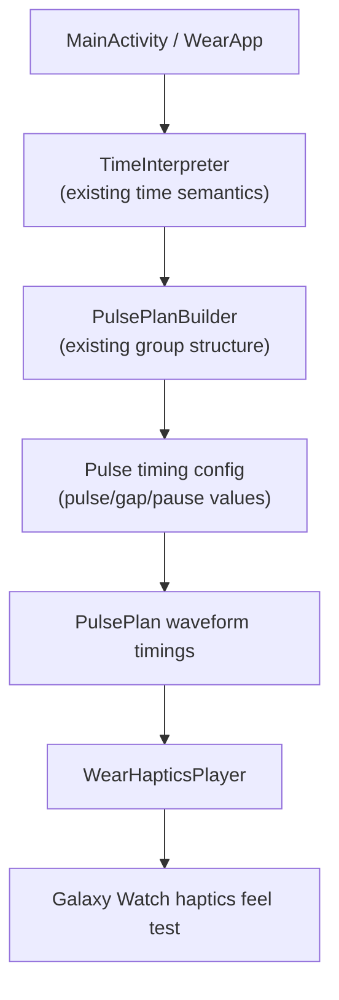
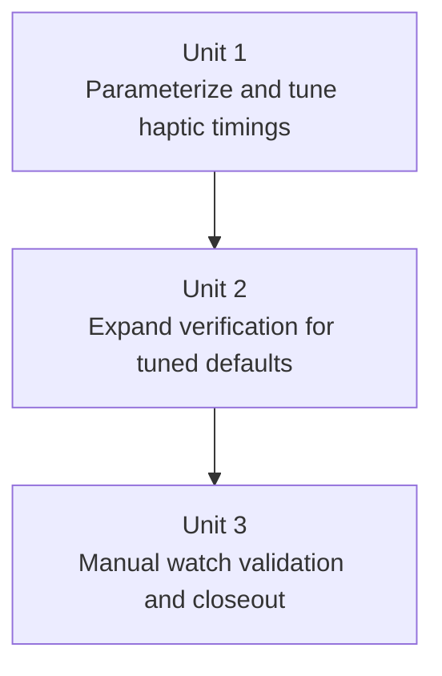

# feat: Tune TacTime Wear OS haptics

## Overview

Refine TacTime’s existing vibration playback from a working baseline into a balanced default pattern that feels countable and reasonably quick on the Galaxy Watch 6 Classic. This iteration should preserve the current time language, single-button interaction, and no-settings scope while making the haptic timings explicit, testable, and easier to tune safely.

## Problem Frame

TacTime already reads the time, converts it into pulse groups, and plays a waveform on demand. The next step is to make the default haptic timing feel intentional rather than arbitrary: readable enough to count, fast enough not to feel tedious, and still simple enough to ship without adding tuning controls or alternate encodings (see origin: `docs/brainstorms/2026-04-10-tactime-mvp-requirements.md`).

## Requirements Trace

- R1. Present a primary `Tell Time` action on the main screen.
- R2. Read the current local watch time when the user triggers the action.
- R3. Show the interpreted time in plain text after playback.
- R4. Encode time in 12-hour form.
- R5. Round to the nearest quarter-hour.
- R5a. Round exact midpoints up.
- R6. Support `:00`, `:15`, `:30`, and `:45`.
- R7. Encode the hour as the first pulse group.
- R8. Encode quarter count as a second pulse group after a pause when quarter is non-zero.
- R9. Omit the second pulse group for `:00`.
- R10. Preserve the agreed example mappings.
- R11. Tune the default pulse timing for a balanced feel on the watch.
- R12. Keep literal hour-count encoding, including larger hour values.
- R13. Ship one tuned default pattern in code with no user-facing tuning settings.

## Scope Boundaries

- No background playback, tile, complication, watch face, or phone companion.
- No settings for alternate haptic languages, 24-hour mode, or different rounding behavior.
- No user-facing vibration speed controls or developer tuning UI in this pass.
- No watchOS implementation in this plan.

## Context & Research

### Relevant Code and Patterns

- The project is a single-module Wear OS app rooted at [app/build.gradle.kts](/Users/colin.finger/tactime/app/build.gradle.kts) using Kotlin, Compose for Wear OS Material 3, and a standalone watch manifest in [AndroidManifest.xml](/Users/colin.finger/tactime/app/src/main/AndroidManifest.xml).
- The current button-driven flow lives in [MainActivity.kt](/Users/colin.finger/tactime/app/src/main/java/com/colfinstudio/tactime/presentation/MainActivity.kt) and already wires interpreted time to pulse-plan generation and playback.
- Haptic timings currently live as defaults in [PulsePlan.kt](/Users/colin.finger/tactime/app/src/main/java/com/colfinstudio/tactime/haptics/PulsePlan.kt), which gives this tuning pass a clear seam without changing the screen contract.
- [PulsePlanBuilder.kt](/Users/colin.finger/tactime/app/src/main/java/com/colfinstudio/tactime/haptics/PulsePlanBuilder.kt) preserves the existing pulse-language structure, so timing work can stay separate from time semantics.
- [WearHapticsPlayer.kt](/Users/colin.finger/tactime/app/src/main/java/com/colfinstudio/tactime/haptics/WearHapticsPlayer.kt) already uses Android’s vibration APIs with `VibratorManager` on API 31+, so the main implementation work is tuning and validation rather than platform integration.

### Institutional Learnings

- The repo includes a testing learning in [wear-compose-instrumentation-tests-need-deterministic-dependencies-2026-04-10.md](/Users/colin.finger/tactime/docs/solutions/best-practices/wear-compose-instrumentation-tests-need-deterministic-dependencies-2026-04-10.md). Any UI tests added or changed in this pass should continue using deterministic injected dependencies rather than relying on live clock values or real haptics.

### External References

- Android’s `VibrationEffect.createWaveform(...)` is the supported mechanism for explicit timing patterns, including alternating off/on durations starting with an initial off duration of `0`: [VibrationEffect API reference](https://developer.android.com/reference/android/os/VibrationEffect).
- `VibratorManager` remains the modern access path on API 31+ and exposes the default vibrator used by the current implementation: [VibratorManager API reference](https://developer.android.com/reference/android/os/VibratorManager).
- Compose for Wear OS remains the recommended UI layer, which supports keeping all tuning UI decisions out of scope while still validating the one-button interaction path: [Compose for Wear OS](https://developer.android.com/training/wearables/compose-setup).

## Key Technical Decisions

- **Tune by parameterizing the existing pulse plan, not by changing the language**: keep hour/quarter grouping identical and adjust only pulse duration, inter-pulse gap, and group separation. This directly matches the product decision to preserve literal encoding and avoid scope creep.
- **Keep one default tuned profile in code**: expose timing values as named constants or a small timing configuration object inside the haptics layer, but do not add settings, variants, or UI controls in this pass.
- **Validate the timing at two levels**: pure tests should verify the generated waveform structure for the chosen constants, while manual watch testing should validate whether the balanced feel is actually acceptable on the Galaxy Watch 6 Classic.
- **Preserve manual retry as the only replay model**: playback remains a single run per button press, so tuning must improve readability within one pass rather than relying on auto-repeat to compensate.

## Open Questions

### Resolved During Planning

- Where should the tuning live? In the existing haptics layer, centered on `PulsePlan` defaults or a small timing configuration object, so the UI and time semantics remain untouched.
- Should the tuning pass alter hour encoding for `11` and `12`? No; the requirements explicitly keep literal hour-count encoding in this pass.
- Should replay behavior change as part of tuning? No; manual retry through the existing `Tell Time` button remains the only replay path.

### Deferred to Implementation

- What exact millisecond values best achieve the chosen balanced feel on the Galaxy Watch 6 Classic? This needs real watch validation after a first-pass timing choice is encoded.
- Does the final tuned pattern still feel acceptable for larger hour counts like `11` and `12`? This must be judged during manual watch testing because waveform correctness alone will not answer the usability question.

## High-Level Technical Design

> *This illustrates the intended approach and is directional guidance for review, not implementation specification. The implementing agent should treat it as context, not code to reproduce.*

## Implementation Units

- [x] **Completed foundation: Existing MVP implementation**

**Goal:** Preserve the already-shipped TacTime MVP baseline that reads time, builds pulse groups, plays haptics, and shows confirmation text.

**Requirements:** R1-R10

**Dependencies:** None

**Files:**
- Existing: `/Users/colin.finger/tactime/app/src/main/java/com/colfinstudio/tactime/time/InterpretedTime.kt`
- Existing: `/Users/colin.finger/tactime/app/src/main/java/com/colfinstudio/tactime/time/TimeInterpreter.kt`
- Existing: `/Users/colin.finger/tactime/app/src/main/java/com/colfinstudio/tactime/haptics/PulsePlan.kt`
- Existing: `/Users/colin.finger/tactime/app/src/main/java/com/colfinstudio/tactime/haptics/PulsePlanBuilder.kt`
- Existing: `/Users/colin.finger/tactime/app/src/main/java/com/colfinstudio/tactime/haptics/WearHapticsPlayer.kt`
- Existing: `/Users/colin.finger/tactime/app/src/main/java/com/colfinstudio/tactime/presentation/MainActivity.kt`

**Approach:**
- Keep this baseline intact and avoid reworking time interpretation, button flow, or the pulse-language structure during the tuning pass.

**Patterns to follow:**
- Treat the current haptics implementation as the seam to refine, not as an invitation to redesign the whole app.

**Test scenarios:**
- Test expectation: none -- this unit records the already-completed baseline and does not add behavior.

**Verification:**
- The existing app remains the reference point for the tuning pass and does not regress as later units land.

- [x] **Unit 1: Parameterize and tune the default haptic timing**

**Goal:** Replace the current arbitrary default timing constants with a deliberate balanced profile that keeps the existing pulse language intact while making playback easier to count.

**Requirements:** R7, R8, R9, R10, R11, R12, R13

**Dependencies:** Completed foundation

**Files:**
- Modify: `/Users/colin.finger/tactime/app/src/main/java/com/colfinstudio/tactime/haptics/PulsePlan.kt`
- Modify: `/Users/colin.finger/tactime/app/src/main/java/com/colfinstudio/tactime/haptics/PulsePlanBuilder.kt`
- Modify: `/Users/colin.finger/tactime/app/src/test/java/com/colfinstudio/tactime/haptics/PulsePlanBuilderTest.kt`

**Approach:**
- Promote the default lead-in, pulse, gap, and group-pause values into a clearly named tuning surface inside the haptics layer, such as one small timing config object or a more explicit constant set.
- Keep `PulsePlanBuilder` responsible only for pulse groups unless timing values need to be injected there for testability; if so, pass them as a small dependency rather than scattering constants across files.
- Choose an initial balanced profile that is modestly slower than the current default if needed to improve countability, but preserve a single shared profile for all pulse groups.
- Avoid adding branching based on hour size, replay count, or hidden modes during this pass.

**Technical design:** *(directional guidance, not implementation specification)*
- `InterpretedTime` continues to define only semantic counts.
- The haptics layer supplies one tuned timing profile: `leadInPulseDuration`, `leadInPause`, `pulseDuration`, `pulseGap`, `groupPause`.
- `PulsePlan` continues to turn group structure plus timing values into waveform timings for Android playback.

**Patterns to follow:**
- Preserve the current separation between semantic time interpretation and haptics playback.
- Keep timing data close to [PulsePlan.kt](/Users/colin.finger/tactime/app/src/main/java/com/colfinstudio/tactime/haptics/PulsePlan.kt), where waveform generation already lives.

**Test scenarios:**
- Happy path: interpreted `3:00` begins with the tuned lead-in cue, then uses the tuned pulse duration and gap values while still producing a single hour group.
- Happy path: interpreted `3:30` uses the tuned lead-in cue and the tuned group-separation pause between the hour and quarter groups.
- Edge case: interpreted `12:00` still produces literal 12 pulses with the tuned default timings, with no special shortcut behavior.
- Edge case: quarter `0` still omits the second group entirely even after timing refactoring.
- Integration: the tuned waveform timings still begin with an initial `0` delay and alternate correctly between on/off durations for Android playback.
- Integration: the group-separation pause remains longer than the inter-pulse gap after tuning.

**Verification:**
- The codebase exposes one obvious default timing profile, and the generated waveform timings reflect that profile consistently across hour-only and hour-plus-quarter cases.
- Completed with a single `PulseTimingProfile.Balanced` default in [PulsePlan.kt](/Users/colin.finger/tactime/app/src/main/java/com/colfinstudio/tactime/haptics/PulsePlan.kt): `320ms` lead-in pulse, `320ms` lead-in pause, `140ms` pulse, `110ms` intra-group gap, `440ms` group pause.

- [x] **Unit 2: Preserve screen behavior while validating the tuned defaults**

**Goal:** Keep the one-button screen behavior unchanged while updating automated checks to prove the tuned haptic path still produces the expected visible outcomes and timing structure.

**Requirements:** R1, R2, R3, R3a, R7, R8, R9, R10, R11, R13, success criteria

**Dependencies:** Unit 1

**Files:**
- Modify: `/Users/colin.finger/tactime/app/src/main/java/com/colfinstudio/tactime/presentation/MainActivity.kt`
- Modify: `/Users/colin.finger/tactime/app/src/androidTest/java/com/colfinstudio/tactime/presentation/MainActivityTest.kt`
- Modify: `/Users/colin.finger/tactime/app/src/test/java/com/colfinstudio/tactime/haptics/PulsePlanBuilderTest.kt`

**Approach:**
- Keep the screen contract unchanged: one `Tell Time` action, one visible confirmation, no replay UI, and no tuning controls.
- Continue using deterministic injected dependencies in instrumentation tests so the UI assertions remain stable even as haptic timing values change underneath.
- Add or update test coverage where it helps prove that the tuned defaults still produce the expected fallback and success text while preserving the one-tap flow.

**Execution note:** Implement the screen integration with UI verification in mind; prefer adding the compose UI test alongside the screen change rather than treating UI checks as an afterthought.

**Patterns to follow:**
- Extend the existing one-screen structure in [MainActivity.kt](/Users/colin.finger/tactime/app/src/main/java/com/colfinstudio/tactime/presentation/MainActivity.kt) instead of introducing navigation or multiple presentation layers.
- Follow the deterministic dependency pattern captured in [wear-compose-instrumentation-tests-need-deterministic-dependencies-2026-04-10.md](/Users/colin.finger/tactime/docs/solutions/best-practices/wear-compose-instrumentation-tests-need-deterministic-dependencies-2026-04-10.md).

**Test scenarios:**
- Happy path: tapping `Tell Time` with a fixed injected time still updates the status text to the expected interpreted time.
- Happy path: the main screen still exposes one obvious `Tell Time` action and no extra tuning controls.
- Error path: when haptics are unavailable, the screen still shows the fallback copy instead of crashing.
- Integration: timing refactoring in the haptics layer does not change the screen’s displayed text contract.

**Verification:**
- Emulator automation still verifies the one-button flow, and the screen does not gain any new controls or replay behavior.
- Verified with `./gradlew testDebugUnitTest` and `ANDROID_SERIAL=emulator-5554 ./gradlew connectedDebugAndroidTest`.

- [x] **Unit 3: Validate and finalize the balanced timing on the Galaxy Watch**

**Goal:** Use the real Galaxy Watch 6 Classic to validate whether the tuned default timing actually feels balanced and make one bounded adjustment pass if needed.

**Requirements:** R11, R12, R13, success criteria

**Dependencies:** Unit 1, Unit 2

**Files:**
- Modify: `/Users/colin.finger/tactime/app/src/main/java/com/colfinstudio/tactime/haptics/PulsePlan.kt`
- Optional modify: `/Users/colin.finger/tactime/app/src/test/java/com/colfinstudio/tactime/haptics/PulsePlanBuilderTest.kt`
- Optional modify: `/Users/colin.finger/tactime/docs/plans/2026-04-11-002-tune-tactime-haptics.md`

**Approach:**
- Run a short manual validation pass on the physical watch using representative times that cover hour-only, quarter, and high-hour-count cases.
- Judge the timing against the agreed balanced goal: countable without feeling unnecessarily slow.
- If the first tuned profile still feels off, make one focused timing adjustment pass rather than opening-ended iterative tweaking.
- Record any unresolved usability concern as a follow-up instead of silently broadening scope into alternate encodings or settings.

**Patterns to follow:**
- Treat the watch as the source of truth for haptic feel; emulator validation is helpful for automation but not for deciding the final timing.
- Keep tuning changes confined to the default timing surface established in Unit 1.

**Test scenarios:**
- Happy path: `3:00`, `3:15`, and `3:45` feel countable on the physical watch with the tuned default.
- Edge case: `11:45` and `12:00` remain usable enough with literal pulse counts and do not trigger a redesign in this pass.
- Integration: after any final timing adjustment, the waveform tests still match the committed default values.

**Verification:**
- Manual watch testing confirms the chosen timing profile is acceptable as the single shipped default, or the remaining concern is explicitly documented for later work.
- Completed with on-device validation on the Galaxy Watch 6 Classic. The final tuned profile was judged better on-wrist, including the added lead-in cue and the longer settling pause before the countable pulses begin.

## System-Wide Impact

- **Interaction graph:** The launcher activity and one-button flow remain unchanged; only the haptics timing configuration and related verification paths should move.
- **Error propagation:** Playback failures should continue surfacing as controlled fallback status text, with no new error surfaces introduced by tuning.
- **State lifecycle risks:** The app stays stateless between launches; the main risk is tuning values drifting from tests or changing feel on-device without being reflected in verification.
- **API surface parity:** No new settings, controls, or external interfaces are introduced.
- **Integration coverage:** Pure tests should own waveform structure, emulator tests should own the visible flow, and physical watch checks should own the haptic-feel decision.
- **Unchanged invariants:** The app remains standalone, single-screen, local-only, literal-hour encoded, and manually retriggered.

## Risks & Dependencies

| Risk | Mitigation |
|------|------------|
| A timing profile that looks sensible in tests may still feel too fast or too slow on the watch | Make physical-watch validation a required completion step for this pass |
| Large literal hour counts may still feel cumbersome after tuning | Explicitly test representative high-hour-count cases and defer encoding redesign rather than sneaking it into this pass |
| Timing refactors could weaken the deterministic tests added in the previous pass | Keep injected dependencies in instrumentation tests and strengthen waveform assertions in pure tests |
| The current rounding implementation still ignores seconds near boundaries | Keep this known issue out of scope for the tuning pass unless the user explicitly reprioritizes it |

## Documentation / Operational Notes

- Update the solution note or plan only if the tuning pass reveals a durable testing or haptics lesson worth preserving.
- No rollout or operational monitoring is needed for this local MVP app.

## Sources & References

- **Origin document:** [2026-04-10-tactime-mvp-requirements.md](/Users/colin.finger/tactime/docs/brainstorms/2026-04-10-tactime-mvp-requirements.md)
- Related code: [PulsePlan.kt](/Users/colin.finger/tactime/app/src/main/java/com/colfinstudio/tactime/haptics/PulsePlan.kt)
- Related code: [PulsePlanBuilder.kt](/Users/colin.finger/tactime/app/src/main/java/com/colfinstudio/tactime/haptics/PulsePlanBuilder.kt)
- Related code: [WearHapticsPlayer.kt](/Users/colin.finger/tactime/app/src/main/java/com/colfinstudio/tactime/haptics/WearHapticsPlayer.kt)
- Related code: [MainActivity.kt](/Users/colin.finger/tactime/app/src/main/java/com/colfinstudio/tactime/presentation/MainActivity.kt)
- Related test: [PulsePlanBuilderTest.kt](/Users/colin.finger/tactime/app/src/test/java/com/colfinstudio/tactime/haptics/PulsePlanBuilderTest.kt)
- Related learning: [wear-compose-instrumentation-tests-need-deterministic-dependencies-2026-04-10.md](/Users/colin.finger/tactime/docs/solutions/best-practices/wear-compose-instrumentation-tests-need-deterministic-dependencies-2026-04-10.md)
- External docs: [Compose for Wear OS](https://developer.android.com/training/wearables/compose-setup)
- External docs: [VibrationEffect](https://developer.android.com/reference/android/os/VibrationEffect)
- External docs: [VibratorManager](https://developer.android.com/reference/android/os/VibratorManager)
